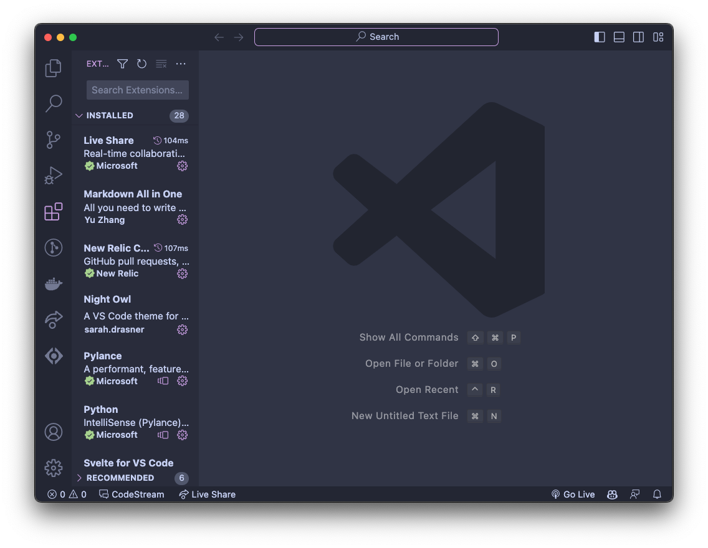
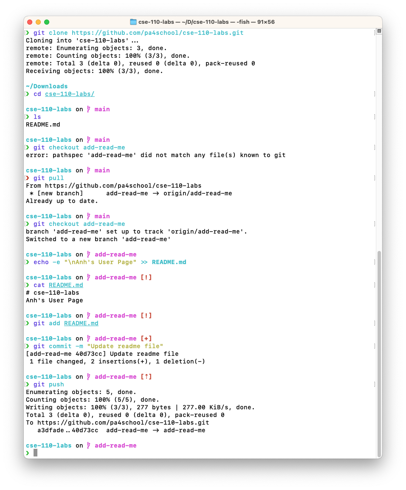
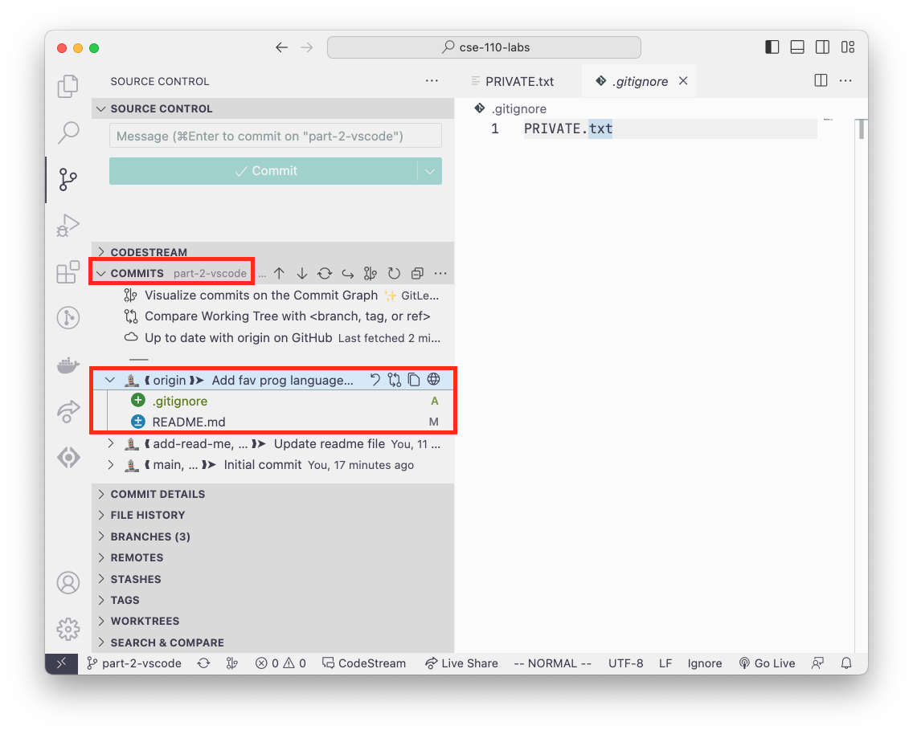

# Task List
- [x] Image of screenshot for part 1, part 2, and part 3







- [x] 1. Headings
- [x] 2. Styling text
- [x] 3. Quoting text
- [x] 4. Quoting code
- [x] 5. External Links
- [x] 6. Section links
- [x] 7. Relative links (Link to another .md file or an image in your repo. If linking to an image, encode it as a regular link rather than an image.)
- [x] 8. Ordered and Unordered Lists
- [x] 9. Task lists
- [ ] A blank task list item

# 1. Headings

# Heading 1

## Heading 2

### Heading 3


# 2. Styling text

**Bold text**

*Italic*

~~Strikethrough~~

**_Nested Italic & Bold_**

***Italic & Bold***

Subscript: Turing<sub>const</sub>

Superscript: x squared, x<sup>2</sup>

# 3. Quoting text

> "There are two ways to write error-free programs; only the third works." - Alan J. Perlis

# 4. Quoting code

One line code: `print("Hello World")`

Multi-line code:
```javascript
const myFunction = () => {
  console.log("Hello World");
}
```

# 5. External Links

[CSE Catalog](https://catalog.ucsd.edu/courses/CSE.html)

# 6. Section links

[Jump back to Task List](#task-list)

# 7. Relative links

[Go to README.md](./README.md)

[Go to screenshots folder](./screenshots)

# 8. Ordered and Unordered Lists

## Unordered List

- Item 1
- This is a nested list
  - Item 2
  - Item 3
    - Nested item 3.1
    - Nested item 3.2


## Ordered List

1. Item 1
2. Item 2
3. Item 3
   - Nested tem 3.1
   - Nested item 3.2
   - Nested item 3.3

# 9. Task lists

[Jump back to Task List](#task-list)