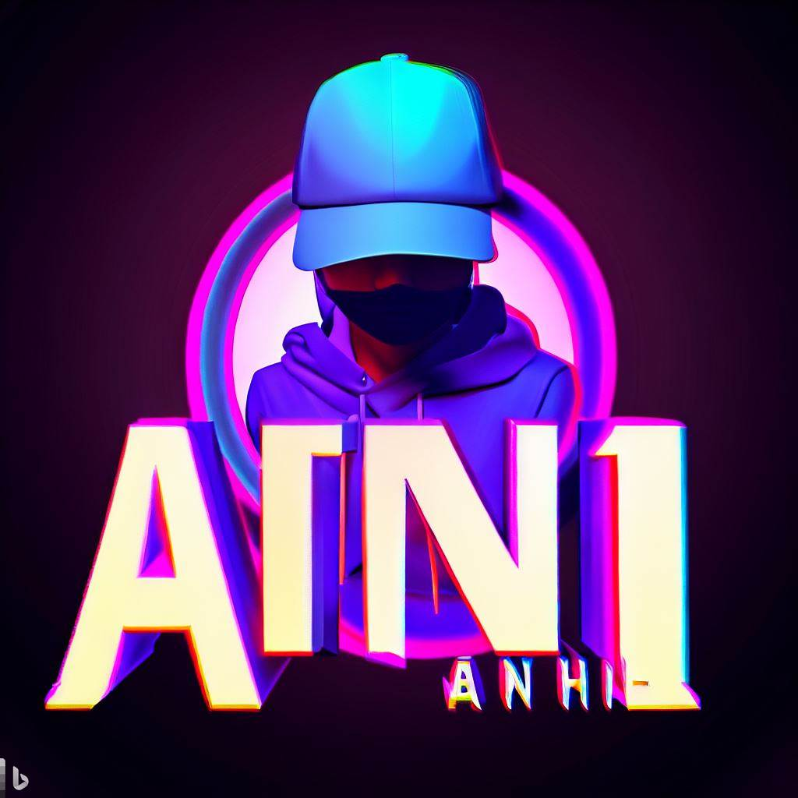

# Welcome to my User Page!

## About me



My name is **Anh** and I'm majoring in *Computer Science* at ~~Sixth~~ Revelle College at [UCSD](https://ucsd.edu/). 

I have a passion for **_designing_** and ***creating*** user-friendly interfaces for web and mobile applications. 

Some of my hobbies are:

- Coding. ([My Favorite Programming Language](#my-favorite-programming-language))
- Listening to music
- Playing video games

## My favorite programming language

I like javascript and learning how to code websites as well. Here is a snippet of code that prints "Hello World" in the modern ES6 syntax:

```javascript
const helloWorld = () => {
  console.log("Hello World");
}
```

## My Goals

I have a dream of working for FAANG, especially Apple. Here are some of the steps I plan to take to achieve this are:

1. Finish my Bachelor's degree in Computer Science
2. Create a portfolio of projects that showcase my skills
3. Apply for an internship at Apple and impress them with my work
4. Pursue a career as a full-time software engineer

## Contact me

If you want to get in touch with me, you can email me at [pap002@ucsd.edu](mailto:pap002@ucsd.edu) or follow me on [LinkedIn](https://www.linkedin.com/in/phuanh004).

## Fun facts

- My name in binary using subscripts, such as A<sub>01000001</sub> N<sub>01001110</sub> H<sub>01001000</sub>.
- I can write the Big O notation for some common algorithms using superscripts, such as O(n<sup>2</sup>) for bubble sort and O(log n) for binary search in Markdown.

- This is my favorite line of joke in coding:

> "There are two ways to write error-free programs; only the third works." - Alan J. Perlis
## To-do list

These are some of the tasks I need to complete my content in this page:

- [x] Rewrite my profile content using markdown syntax
- [x] Publish the web page through GitHub Pages
- [ ] Share the link to my page with my friends and family

